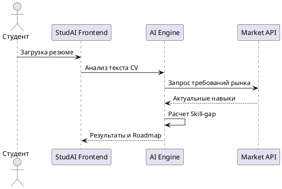

# StudAI: Core Product Specification

## 1. Видение продукта и Бизнес-модель (Vision & Business Canvas)
**StudAI** — это ИИ-ассистент для студентов и выпускников, который помогает превратить хаотичный поиск работы в структурированный процесс достижения оффера.

### Проблема и Решение
*   **Проблема:** Студенты не понимают требований рынка; резюме без опыта теряются среди конкурентов; информационный шум вызывает паралич выбора.
*   **Решение:** Автоматизированный анализ навыков (Skill-gap), построение персональной дорожной карты обучения и умный мэтчинг с актуальными вакансиями.

### Бизнес-Канва
| Блок | Содержание |
|------|--------------|
| **ЦА (B2C)** | Студенты и выпускники 20-25 лет. |
| **ЦА (B2B)** | Вузы, карьерные центры, EdTech-платформы. |
| **УТП** | ИИ-карьерный консультант: персонально, масштабируемо и в 10 раз дешевле живого эксперта. |
| **Каналы** | Telegram, партнерства с вузами, контент-маркетинг. |
| **Монетизация** | Подписка (990₽/мес) + Success Fee (3900₽) + AI-интервью (490₽). B2B лицензия (149к/год). |
| **Метрики** | Целевой LTV/CAC = 9:1 (LTV ~5380₽, CAC ~600₽). |

## 2. Архитектура и Технологии (Architecture & Stack)
Система строится вокруг **«Карьерного ИИ-графа»** — динамического профиля компетенций пользователя.

### Технологический стек
*   **Frontend:** React (TypeScript) + Vite + Tailwind CSS.
*   **Backend:** Python (FastAPI).
*   **AI:** LLM (GPT-4 / Claude / Llama 3) через API или локально (gguf).
*   **База данных:** PostgreSQL + Vector DB (для хранения графов и мэтчинга).

### Структура данных (Data Moat)
*   **User:** Профиль, статус подписки, история взаимодействий.
*   **Career Graph:** Скиллы (Hard/Soft), опыт, цели, прогресс обучения.
*   **Market Benchmark:** Агрегированные требования рынка (обновляются через парсинг HH.ru и др.).
*   **Vacancy Match:** Результаты скоринга и статусы откликов.

## 3. Функциональные модули (User Journey)

### Модуль 1: Диагностика и Анализ
1.  **Загрузка резюме:** Парсинг PDF/DOC с помощью ИИ.
2.  **Skill-gap анализ:** Сравнение навыков пользователя с эталонными требованиями рынка.
3.  **Визуализация:** Отображение сильных сторон и дефицитов.

### Модуль 2: Развитие (Roadmap)
1.  **Генерация плана:** Пошаговая карта развития навыков.
2.  **Подбор контента:** Рекомендация курсов (EdTech API), статей и упражнений.

### Модуль 3: Трудоустройство (Matching)
1.  **Умный поиск:** Подбор вакансий с наивысшим процентом совпадения скиллов.
2.  **Поддержка:** Советы по адаптации резюме под конкретные вакансии.
3.  **Оффер:** Фиксация успеха и переход в статус "Success".

### Модуль 4: Практика (Биржа проектов)
1.  **Создание (B2B):** Компании публикуют проекты с бюджетом. Доступны режимы работы с одной командой или соревнование между командами (оплата победителю).
2.  **Поиск и Мэтчинг (B2C):** Студенты откликаются на проекты. ИИ подсвечивает weak-spots студента, которые он сможет прокачать, выполняя этот проект.
3.  **Контроль и Наставничество:** К проекту подключаются преподаватели (берут на себя роль гаранта/наблюдателя).
4.  **Финансы:** Платформа берет комиссию, остаток делится 70% студентам (исполнителям) и 30% куратору-преподавателю.

## 4. Диаграмма взаимодействия (UML Sequence)

## 5. Команда и Управление проектом
*   **Андрей (CEO / Product):** Бизнес-логика, маркетинг, B2B продажи.
*   **Тимофей (AI / Backend Lead):** Архитектура, LLM промпты, интеграция API.
*   **Виталий (Frontend / TG Bot):** UI/UX, платежи, интерфейс бота/веба.

### Риски и Планы Б
*   **Блокировка API:** Использование альтернативных источников (Хабр, Работа.ру) и собственных парсеров.
*   **Низкий Success Fee:** Геймификация и доп. услуги в подписке.
*   **Команда:** Вестинг и четкое распределение долей.

## 6. Дорожная карта (Roadmap)
1.  **Месяц 1 (Прототип):** AI-промпты, лендинг, ручной тест (Консьерж-MVP).
2.  **Месяц 2 (MVP):** Автоматизация бота, биллинг, интеграция Core-модулей.
3.  **Месяц 3 (Запуск B2C):** Маркетинг в Telegram, первые 500 платящих юзеров.
4.  **Месяц 4 (Success Fee):** Тестирование сбора комиссии за офферы, AI-интервью.
5.  **Месяц 5-6 (B2B):** Пилоты с вузами, SaaS-дашборды.
